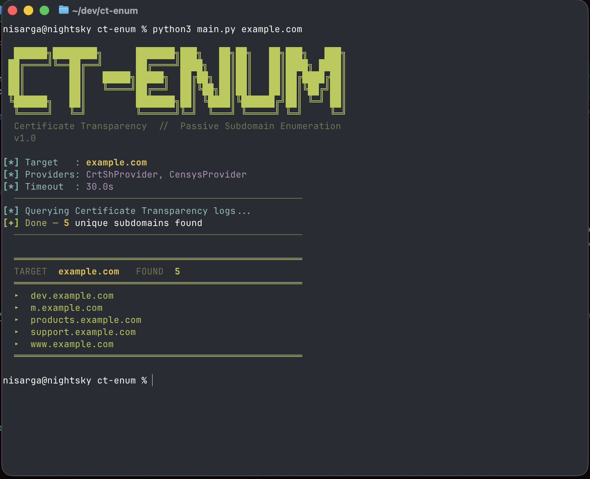

# ct-enum



[](https://www.python.org/)
[](https://docs.aiohttp.org/)
[]()
[]()

Passive subdomain enumeration via Certificate Transparency logs (crt.sh + optional Censys).

## Project Structure

```
ct-enum/
├── main.py          # CLI entry point
├── ct_sources.py    # CT provider implementations (crt.sh, Censys)
├── parser.py        # Name extraction, normalization, filtering
└── utils.py         # Domain validation, backoff, formatting
```

## Requirements

- Python 3.11+
- [aiohttp](https://docs.aiohttp.org/)

```bash
pip install aiohttp
```

## Usage

```bash
python main.py example.com
```

Output:

```
[*] Target   : example.com
[*] Providers: CrtShProvider, CensysProvider
[*] Timeout  : 30.0s
[*] Querying Certificate Transparency logs...
[+] Done - 5 unique subdomains found

  TARGET  example.com   FOUND  5
  ▸  dev.example.com
  ▸  m.example.com
  ▸  products.example.com
  ▸  support.example.com
  ▸  www.example.com
```

### JSON output

```bash
python main.py example.com --json
```

```json
{
  "domain": "example.com",
  "count": 5,
  "subdomains": [
    "api.example.com",
    "cdn.example.com",
    "mail.example.com",
    "staging.example.com",
    "www.example.com"
  ]
}
```

### Save to file

```bash
python main.py example.com --output results.txt
python main.py example.com --json --output results.json
```

### Other flags

```bash
python main.py example.com --timeout 60   # custom timeout (default: 30s)
python main.py example.com -v             # verbose/debug logging
```

## Flags

| Flag | Type | Default | Description |
|------|------|---------|-------------|
| `domain` | positional | | Target domain, e.g. `example.com` |
| `--json` | flag | off | Output as JSON |
| `--output FILE` | string | | Write output to file |
| `--timeout SECS` | float | `30.0` | HTTP request timeout in seconds |
| `--verbose` / `-v` | flag | off | Enable debug logging |

## Censys Integration

Censys is optional and requires a free API account from [censys.io](https://search.censys.io/).

```bash
export CENSYS_API_ID="your-api-id"
export CENSYS_API_SECRET="your-api-secret"
```

When credentials are present, Censys is queried automatically alongside crt.sh. If not set, it is silently skipped.

## How It Works

1. Queries `crt.sh` for all certificates matching `%.example.com`
2. Optionally queries Censys (if credentials are set)
3. Parses `name_value` and `common_name` fields from each certificate entry
4. Normalizes names: lowercased, wildcard prefixes (`*.`) stripped
5. Deduplicates, filters to valid subdomains of the target, returns sorted

Failed requests and rate limits are retried with exponential backoff (up to 4 attempts, capped at 60s).

## Examples

```bash
python main.py tesla.com
python main.py github.com --json --output github_subs.json
python main.py google.com --timeout 120 -v
python main.py example.com --json | jq '.subdomains[]'
```

## Extending

Implement the `CTProvider` abstract base class in `ct_sources.py` and register it in `get_providers()`:

```python
from ct_sources import CTProvider

class MyProvider(CTProvider):
    async def fetch(self, domain: str, session: aiohttp.ClientSession) -> list[dict]:
        ...

def get_providers() -> list[CTProvider]:
    return [CrtShProvider(), CensysProvider(), MyProvider()]
```

## Notes

- Results reflect historical certificate data, not live/active subdomains
- Wildcard certs (`*.example.com`) are excluded; they don't map to a specific subdomain
- No DNS resolution is performed; this tool is entirely passive